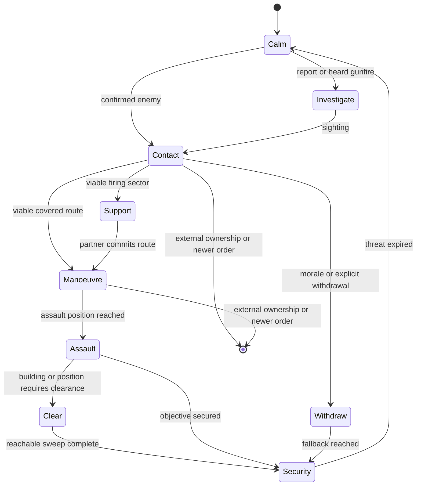

# WAIT Cortex operations

> **Use this page when:** you need to understand or configure WAIT's automatic
> group-level behaviour during contact, movement and recovery.

## Purpose and limits

Cortex is WAIT's optional automatic-tactics layer. It augments native AI only
when an eligible non-player group has a useful combat opportunity. It is not a
replacement for authored mission orders, Zeus commands or another controller
that has claimed the same actors.

CBA is required and provides the configuration authority. ZEN is optional; native
Zeus orders work without it. Configure behaviour from **Options > Addon Options
> Waldos AI Tweaks**, under **General**, **Infantry**, **Coordination**,
**Vehicles**, **Convoys**, **Aircraft**, and **Support and civilians**.

The CBA master setting **Enable Cortex automatic tactics** is on by default.
Each family also has its own gate. A setting marked **Live** is adopted by the
next owner-local update; a setting marked **Next operation** is guaranteed for
a new action without discarding a committed action halfway through.

## Ownership and interruption

One controller owns movement at a time. WAIT creates a finite operation only
when it can own the affected action. The operation records an intent,
generation, owner locality, participants, route, physical progress and a
cancellation reason.

WAIT immediately releases a conflicting operation when any of these occurs:

- a Zeus edit, move, waypoint, remote-control action or explicit native order;
- player control of the actor;
- a newer mission order;
- locality migration or an external controller marker;
- a lost target, impossible route, casualty collapse or safety failure.

Release removes only movement, postures, speed limits and state previously
owned by that operation. It does not restore an older formation, seat
assignment or waypoint over a newer external decision.

## Contact flow

A bounded owner-local engine danger FSM records immediate observations and
wakes the group's single shared decision job. A valid first event can start that
brain immediately instead of waiting for the periodic discovery sweep. The FSM
terminates after draining its short engine queue and does not add a per-unit
permanent movement loop or movement owner.

## Infantry actions

| Action | Expected behaviour | Completion or release |
| --- | --- | --- |
| Investigate | A suitable element checks an approximate reported or heard location while the group retains security. | Sighting, arrival, time limit, new order or loss of route. |
| Advance | Where numbers permit, a moving element makes short covered bounds while a partner covers. Fire remains native and may continue while moving. | Objective progress, contact change, no-progress recovery exhausted or handover. |
| Flank | Selects a distinct left/right corridor that progresses on the threat without crossing a friendly firing lane. | Side approach reached, target change, unsafe route or handover. |
| Assault | A manoeuvre element continues forward from its assault position while support holds only while its firing sector remains safe. A fresh known threat already too close for advance or flank enters this paired-element operation directly. | Position secured, target lost, casualty collapse, blocked route or handover. |
| Withdraw | A broken element selects a screened route away from the threat. Smoke is optional and never blocks movement. | Physical fallback, bounded incomplete result, newer order or handover. |
| Regroup | Separated survivors close only when they remain unreserved and the tactical situation allows it. | Cohesion, time limit, contact or handover. |

A grenade, smoke throw, straggler or individual recovery cannot freeze the rest
of an operation. WAIT makes one local recovery attempt for a stalled actor;
then marks that actor unavailable and lets the capable element continue. It
never teleports, repairs, unflips or grants immunity as a recovery shortcut.

## Coordination and combined arms

Nearby friendly groups coordinate only when they share compatible intent,
threat knowledge and communication eligibility. The coordinator assigns
short-lived support and manoeuvre roles, offset rally areas and distinct
approach corridors. It rejects routes that cross a partner's firing lane.

A support opportunity adds to ordinary combat; it does not require a scheduled
assembly or override a valid authored order. Roles expire after no physical
progress, target change, casualty collapse, lost communication or external
handover. Vehicles and aircraft can support the same opportunity only when
their own capability and ownership checks pass.

## Buildings

Cortex building actions use a finite physical progression:

1. enumerate entrances, exits and reachable interior positions;
2. choose an entry with a viable approach and safe support sectors;
3. assign a limited entry element, interior lanes and exterior security;
4. record a room only after physical arrival in its position radius and floor;
5. retry a blocked position through another entrance, route or actor;
6. report exhausted positions as unreachable and finish `INCOMPLETE`, never as
   fabricated success.

**Clear** sweeps reachable interior positions then establishes security.
**Garrison** occupies defensible interior positions with exterior security.
**Traverse** enters through one viable side and leaves through an actual exit
on the onward side. Casualties and stalls can rotate capable reserve actors into
the entry element without forcing a group merge.

## Vehicles and convoys

General driving assistance is separate from registered convoy control. General
driving retains native waypoints and applies sparse speed/terrain observation
plus one bounded physical recovery. Convoys add an ordered vehicle column,
predecessor-trail spacing and contact/passenger policy.

Convoys measure forward predecessor gaps to remain single-file; they do not use
formation wedge offsets. Target spacing uses a size-aware minimum/maximum band
with damped speed correction. A meaningful stop is classified as ordered,
contact, spacing, obstruction, immobile or external owner and is reported once
to Zeus. Player-made roadblocks remain valid stops.

Operating crews stay aboard. Cargo dismounts and remounts only while their
convoy task generation still owns them; a newer Zeus task wins immediately.

## Diagnostics

The diagnostic view exposes the active intent, owner, generation, phase,
participants, route, physical-progress age, recovery state, external owner,
scheduler latency, skipped work, replans and final cancellation reason. Use it
to diagnose a real action before changing a setting.

Static validation confirms interfaces, bounded contracts and configuration
parity. It does not prove pathfinding, combat, building entry, convoy recovery
or air combat. Those require the packaged, damage-enabled audit batches.

## Related documentation

- [Settings reference](SETTINGS-REFERENCE.md)
- [Capability registry](CAPABILITY-REGISTRY.md)
- [Addon lifecycle](ADDON-LIFECYCLE.md)
- [Modding and operations](MODDING-AND-OPERATIONS.md)

<!-- WAIT-WIKI-NAV -->
---
[Wiki home](https://github.com/AdamWaldie/WaldosAITweaks/wiki/Home) · [Quickstart](https://github.com/AdamWaldie/WaldosAITweaks/wiki/Quickstart-Guide) · [Feature index](https://github.com/AdamWaldie/WaldosAITweaks/wiki/Feature-Tutorials)
